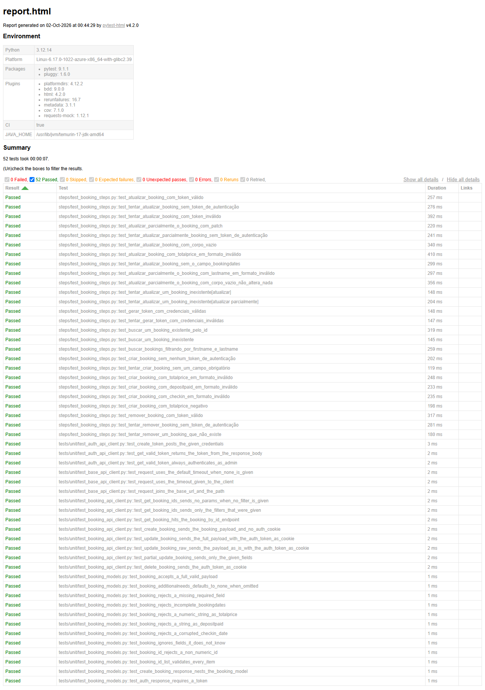

# 🔌 QA API + pytest-bdd - restful-booker

[](https://github.com/ThomasTDS/qa-api-python/actions/workflows/tests.yml)
[](https://codecov.io/gh/ThomasTDS/qa-api-python)
[](https://github.com/ThomasTDS/qa-api-python/actions/workflows/tests.yml)
[](LICENSE)

## Descrição

Este repositório contém testes automatizados da API pública **[restful-booker](https://restful-booker.herokuapp.com)** utilizando **requests** (chamadas HTTP puras, sem navegador), **pytest-bdd (BDD/Gherkin)** e uma camada de **API Clients** que cumpre, para testes de API, o mesmo papel que o Page Object Model cumpre em testes de UI: encapsular as chamadas HTTP e esconder detalhes de endpoint/headers dos steps e dos cenários.

O objetivo é praticar testes de API "de verdade": autenticação, CRUD completo, diferença entre PUT e PATCH, e validação de regras de autorização.



*Exemplo do relatório de execução (captura de tela). O relatório ao vivo e sempre atualizado fica em [thomastds.github.io/qa-api-python](https://thomastds.github.io/qa-api-python/).*

---

## Estrutura do Projeto

```text
qa-api-python/
├── .github/
│   ├── ISSUE_TEMPLATE/
│   │   └── bug_report.md   # Template de Issue para bugs reais
│   ├── workflows/
│   │   ├── tests.yml                  # Pipeline de CI (push, PR e execução diária agendada)
│   │   └── dependabot-auto-merge.yml  # Auto-merge de PRs de patch/minor do Dependabot
│   └── dependabot.yml      # Atualização semanal de dependências (pip e GitHub Actions)
├── docs/
│   ├── assets/             # Imagens usadas no README
│   └── test-cases.md       # Matriz de rastreabilidade dos test cases
├── features/                # Cenários em Gherkin (.feature)
├── steps/                   # Steps do pytest-bdd (testes de integração, batem na API real)
│   ├── test_<feature>.py    # Um módulo por arquivo .feature, com os steps exclusivos dele
│   ├── common_steps.py      # Steps usados por mais de uma feature (tokens, booking criado, 403, 405)
│   └── booking_data.py      # Booking padrão e payloads com campos inválidos
├── tests/
│   └── unit/                # Testes unitários isolados de api/ e models/ (com requests-mock, sem rede)
├── api/                     # API Clients (AuthApiClient e BookingApiClient, sobre a base comum BaseApiClient)
├── models/                  # Schemas Pydantic e tipos derivados (shape dos dados da API)
├── reports/                 # Relatório HTML e cobertura (coverage.xml) gerados a cada execução (não versionado)
├── conftest.py              # Fixtures (contexto por cenário) e captura de evidência de falha
├── pyproject.toml           # Dependências e configuração (pytest, ruff, mypy)
├── .pre-commit-config.yaml  # Hooks de pre-commit (ruff, mypy)
├── codecov.yml              # Metas de cobertura verificadas pelo Codecov nos PRs
├── LICENSE
└── README.md                # Este arquivo
```

---

### Instalar Dependências

```
python -m venv .venv
.venv\Scripts\activate       # PowerShell / Windows
source .venv/bin/activate    # bash / Linux / macOS

pip install -e ".[dev]"
pre-commit install
```

Não é necessário instalar nenhum navegador: como são testes de API, só a biblioteca `requests` é usada para fazer as chamadas HTTP.

### Rodar todos os testes

```
pytest
```

Ao final da execução, um relatório HTML é gerado em `reports/report.html` (não versionado).

O relatório da execução mais recente em `master` também fica publicado em **[thomastds.github.io/qa-api-python](https://thomastds.github.io/qa-api-python/)**, sem precisar rodar nada localmente ou baixar artifact do CI.

### Rodar apenas a smoke suite

```
pytest -m smoke
```

Roda só os fluxos ponta-a-ponta mais críticos (autenticação, criação, consulta, atualização e remoção — ver [docs/test-cases.md](docs/test-cases.md)). Como o `pyproject.toml` sempre escreve no mesmo arquivo, rodar isso depois de `pytest` **sobrescreve** `reports/report.html` com só esses 5 cenários.

### Rodar só os testes unitários

```
pytest tests/unit
```

Testes isolados de `api/` e `models/`, com as chamadas HTTP mocadas via [`requests-mock`](https://requests-mock.readthedocs.io/) — não fazem nenhuma chamada de rede, então rodam em milissegundos e não dependem da API pública estar no ar. Complementam os cenários de `steps/`, que são testes de integração de verdade contra a `restful-booker`.

### Lint e formatação

```
mypy .                    # typecheck
ruff check .              # lint
ruff format --check .     # formatação, só verifica
ruff format .             # formatação, aplica as correções
pip-audit                 # checa dependências instaladas contra vulnerabilidades conhecidas
```

O CI roda `mypy`, `ruff check`, `ruff format --check` e `pip-audit` no job `unit`, antes de qualquer teste contra a API, então mudanças com problema de tipo, estilo ou uma dependência vulnerável falham rápido, sem gastar tempo batendo na API pública. Uma vulnerabilidade encontrada pelo `pip-audit` quebra o CI — não tem como mergear sem resolver ou avaliar o caso pontualmente.

Cada execução de `pytest` já gera cobertura de `api/` e `models/` (código dos API Clients e dos schemas), impressa no terminal e também em `reports/coverage.xml` (não versionado). No CI esse arquivo é enviado para o [Codecov](https://codecov.io/gh/ThomasTDS/qa-api-python), que mantém o histórico e mostra o badge no topo deste README.

O Codecov também bloqueia o merge do PR (configuração em `codecov.yml`) se o código novo ou alterado no PR (`patch`) não vier 100% coberto. O `codecov.yml` também define uma meta para a cobertura total do projeto (`project`), que não pode cair mais de 1 ponto percentual, mas esse check é só informativo: não faz parte dos checks obrigatórios da branch.

Um hook de pre-commit (framework `pre-commit`, instalado via `pre-commit install` após o `pip install`) roda `ruff --fix` e `ruff format` nos arquivos staged, e também `mypy .` no projeto inteiro, antes de cada commit — então a maioria dos problemas de lint, formatação ou tipo já é pega localmente antes de chegar no CI.

### Rodar contra outro ambiente

Por padrão os testes apontam para `https://restful-booker.herokuapp.com` e se autenticam com as credenciais públicas da documentação da API (`admin` / `password123`). Para rodar contra outro ambiente (ex: uma instância local ou de staging), defina as variáveis de ambiente:

| Variável       | Padrão                                  | Uso                                  |
| -------------- | --------------------------------------- | ------------------------------------ |
| `BASE_URL`     | `https://restful-booker.herokuapp.com` | Endereço da API                      |
| `API_USERNAME` | `admin`                                 | Usuário usado para gerar o token     |
| `API_PASSWORD` | `password123`                           | Senha usada para gerar o token       |

```
# PowerShell
$env:BASE_URL="http://localhost:3001"; $env:API_USERNAME="usuario"; $env:API_PASSWORD="senha"; pytest

# bash
BASE_URL=http://localhost:3001 API_USERNAME=usuario API_PASSWORD=senha pytest
```

---

### API testada

| Método | Rota           | Função                                             |
| ------ | -------------- | --------------------------------------------------- |
| POST   | `/auth`        | Gera token de autenticação                         |
| GET    | `/booking`     | Lista IDs de bookings (aceita filtros)             |
| GET    | `/booking/:id` | Busca um booking específico                        |
| POST   | `/booking`     | Cria um booking                                    |
| PUT    | `/booking/:id` | Atualiza um booking (todos os campos obrigatórios) |
| PATCH  | `/booking/:id` | Atualiza parcialmente um booking                   |
| DELETE | `/booking/:id` | Remove um booking                                  |

Autenticação: `POST /auth` com `{ "username": "admin", "password": "password123" }` (credenciais públicas da documentação da API, configuráveis por `API_USERNAME` e `API_PASSWORD`) retorna um token, enviado nas chamadas de `PUT`, `PATCH` e `DELETE` via cookie `token=<valor>`.

**Observação de segurança:** `POST /booking` (criação) **não exige autenticação** — qualquer pessoa consegue criar bookings sem token. Isso é uma falha de controle de acesso do próprio app de demonstração, e está coberta explicitamente em [features/create_booking.feature](features/create_booking.feature) como comportamento documentado, não como bug do teste.

---

### Estrutura de Testes e Padrões Aplicados

- BDD / Gherkin: cenários claros e legíveis em `.feature`, escritos em português (`# language: pt`, com `Funcionalidade`, `Cenário`, `Dado`, `Quando` e `Então`) e executados via `pytest-bdd`.
- API Client Objects: `AuthApiClient` e `BookingApiClient` encapsulam as chamadas HTTP, do mesmo jeito que Page Objects encapsulam elementos de UI.
- Timeout em todas as chamadas HTTP: os dois clients herdam de `BaseApiClient`, que aplica 5 segundos de limite para conectar e 30 para receber a resposta. Sem isso, o `requests` pode esperar indefinidamente, e uma API travada deixaria o CI parado até o limite de execução do GitHub Actions.
- Pirâmide de testes: além dos cenários de BDD (`steps/`), que são testes de integração reais contra a `restful-booker`, `tests/unit/` cobre `api/` e `models/` de forma isolada, com `requests-mock` simulando as respostas HTTP — sem rede, sem depender da API pública estar no ar.
- Validação de schema com [Pydantic](https://docs.pydantic.dev/): as respostas da API são validadas em tempo de execução contra os modelos em `models/booking.py` (fonte única de verdade), não só tipadas por anotação — se a API mudar o formato de uma resposta, o teste falha com uma mensagem clara em vez de passar silenciosamente ou quebrar mais adiante. Os modelos usam o modo estrito do Pydantic, que não converte tipos por conta própria: um `totalprice` enviado como texto (`"150"`), um `depositpaid` como `"true"` ou uma data fora do formato `AAAA-MM-DD` reprovam a validação. Campos extras na resposta são ignorados, porque a API é de terceiros e um campo a mais não é defeito.
- Cobertura de autenticação, CRUD completo, PUT vs. PATCH, e casos de acesso não autorizado (403).
- Relatório HTML automatizado a cada execução (`reports/report.html`, via `pytest-html`), com a versão da `master` publicada em [thomastds.github.io/qa-api-python](https://thomastds.github.io/qa-api-python/) via GitHub Pages.
- Cobertura de código (`pytest-cov`) de `api/` e `models/` em cada execução, acompanhada no [Codecov](https://codecov.io/gh/ThomasTDS/qa-api-python).
- Limpeza automática: a fixture `context` remove o booking criado no cenário (via token próprio de limpeza) ao final de cada teste, evitando acúmulo de dados na API pública. Se a remoção falhar por erro de rede ou de autenticação, o pytest mostra um aviso com o id do booking que ficou para trás, sem mudar o resultado do teste.
- Dados de teste únicos: cada booking criado leva um sufixo aleatório no sobrenome (ex: `Ciclano-3f9a1c`). Como a API pública é compartilhada, inclusive pelas execuções paralelas do CI, a busca por nome encontra só o booking do próprio teste.
- Retry automático só para falhas de rede (`pytest-rerunfailures`, com `--reruns 1` e `only_rerun` no `pyproject.toml`): um teste que falha por erro de conexão ou timeout roda uma segunda vez, amortecendo a instabilidade da API pública de demonstração. Falhas de asserção ou de schema nunca são repetidas, para que um bug intermitente não passe na segunda tentativa.
- Integração contínua via GitHub Actions, em dois jobs: `unit` roda as checagens estáticas e os testes unitários, sem rede, e `integration` só começa se o `unit` passar, rodando a suíte completa contra a API pública. Assim, uma falha no `integration` com o `unit` verde aponta para a API ou para um cenário, e não para o código dos clients. Os dois rodam a cada push e pull request para `master`, em Python 3.12 e 3.13, e também diariamente às 06:00 UTC (ver [.github/workflows/tests.yml](.github/workflows/tests.yml)) para detectar quebras causadas pela própria API pública, com o relatório HTML publicado como artifact do workflow.
- Dependências atualizadas automaticamente pelo Dependabot (pip e GitHub Actions, semanal — ver [.github/dependabot.yml](.github/dependabot.yml)). PRs de patch/minor com CI verde são mergeados automaticamente ([.github/workflows/dependabot-auto-merge.yml](.github/workflows/dependabot-auto-merge.yml)); bumps de major exigem revisão manual.
- Auditoria de vulnerabilidades conhecidas nas dependências instaladas a cada execução do CI, via [`pip-audit`](https://github.com/pypa/pip-audit); encontrar uma vulnerabilidade quebra o build.
- Rastreabilidade de QA: matriz de test cases em [docs/test-cases.md](docs/test-cases.md), com tags `@TC-XXX` em cada `Cenário` e um subconjunto `@smoke` (`pytest -m smoke`) cobrindo os fluxos ponta-a-ponta mais críticos. Bugs reais encontrados são documentados como GitHub Issues usando o template em [.github/ISSUE_TEMPLATE/bug_report.md](.github/ISSUE_TEMPLATE/bug_report.md).

---

### Fluxo de Trabalho

A branch `master` é protegida: toda mudança passa por Pull Request, e o merge só é liberado depois que os checks de CI (`unit (3.12)`, `unit (3.13)`, `integration (3.12)` e `integration (3.13)`) e de cobertura do código novo no Codecov (`codecov/patch`) passarem. Fluxo padrão:

```
git checkout -b minha-branch
# editar, rodar pytest localmente
git push -u origin minha-branch
# abrir PR no GitHub, aguardar os checks passarem, fazer merge
```
